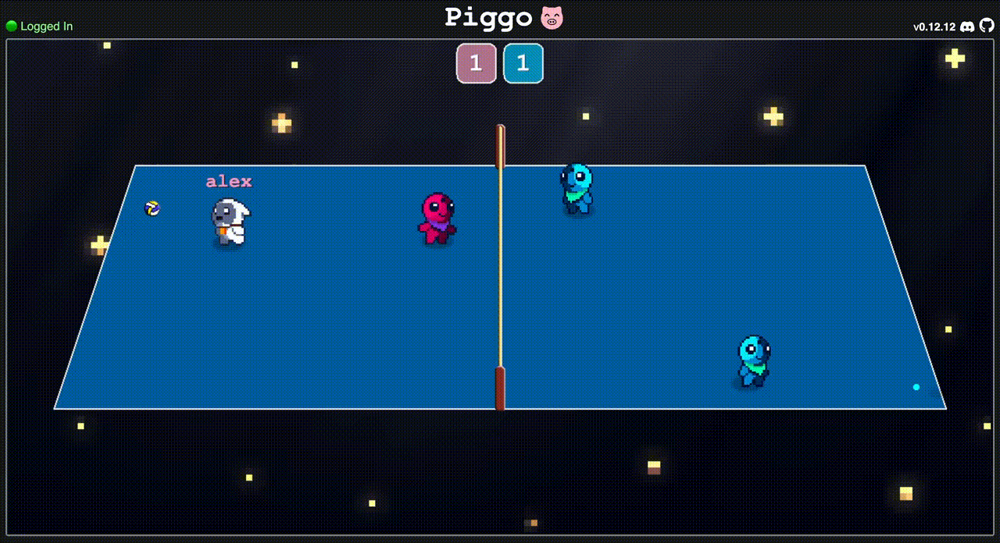

__Piggo__ is an open-source multiplayer web game! Play online at [piggo.gg](https://piggo.gg)

<br>

<p align="center">
  
</p>

## Product Objectives

🐷 fun game modes

🕹️ intuitive UI/UX

🥳 easy to play with friends

## Technical Objectives

👨🏻‍💻 the code is readable

🎮 making new game modes is simple

👾 multiplayer is smooth & performant

# Development

|package|description|
|--|--|
|`core`| core game engine
|`games`| games
|`web`| webapp
|`server`| game server
|`docs`| js bundle & resources (served statically by GitHub Pages)

### setup

```bash
# install dependencies
bun install

# launch server and web
bun dev
```
