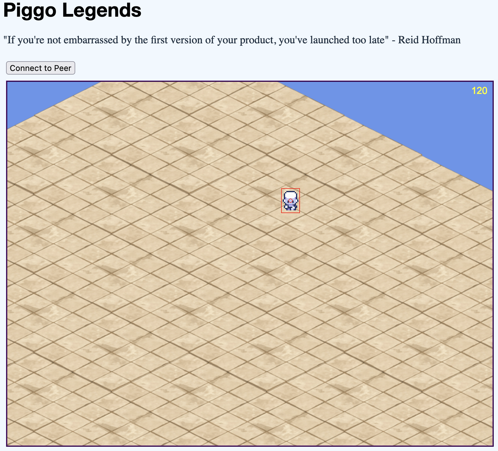

__Piggo Legends__ is a platform for casual multiplayer games



# Objectives

Games are easy to implement using piggo-legends' game framework.

Multiplayer is performant, peer-to-peer, and easily integrated into games. 

Piggo Legends supports polyglot clients (desktop, web, mobile) across a variety of game types.

Social features like chat and voice have first class support.

# Development

### setup

```bash
# configure yarn
yarn set version stable
yarn plugin import workspace-tools

# install dependencies
yarn install

# serve the game locally
yarn start
```

### publishing to GitHub Pages
```
yarn pages
```

# Features

#### game framework
- [x] ECS abstract classes
- [x] GameRTC abstract classes
- [ ] integrate netcode with GameRTC classes

#### netcode
- [x] WebRTC handshake works in browser
- [x] WebRTC transfer media
- [x] WebRTC connection over internet (fails for some network configurations like LTE)
- [ ] WebRTC game state transfer
- [ ] WebRTC >2 players in one game

#### presentation layer
- [x] Pixi.js renders to html canvas
- [ ] render the game with Pixi.js
- [ ] Electron desktop client
- [ ] React Native mobile client
