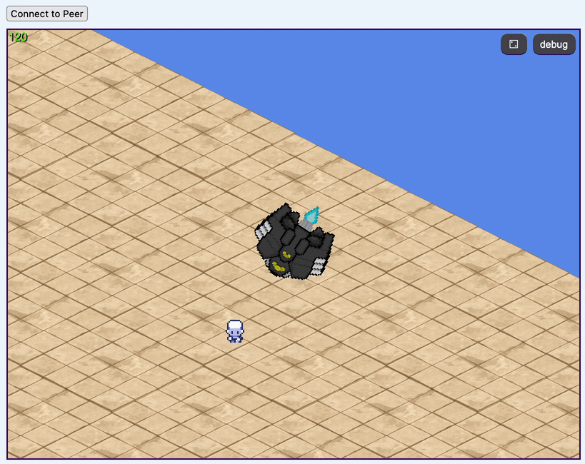

__Piggo Legends__ is a platform for casual multiplayer games

<kbd>

</kbd>

# Objectives

Games are easy to implement using piggo-legends' game framework.

Multiplayer is performant, peer-to-peer, and easily integrated into games. 

Piggo Legends supports polyglot clients (desktop, web, mobile) across a variety of game types.

Social features like chat and voice have first class support.

# Development

### setup

```bash
# configure yarn
yarn set version stable
yarn plugin import workspace-tools

# install dependencies
yarn install

# serve the game locally
yarn start
```

### publishing to GitHub Pages
```
yarn pages
```

# Features

#### netcode
- [x] WebRTC handshake works in browser
- [x] WebRTC transfer media
- [x] WebRTC connection over internet (fails for some network configurations like LTE)
- [ ] WebRTC game state transfer
- [ ] WebRTC >2 players in one game

#### Pixi.js
- [x] render to html canvas
- [x] render game objects
- [x] camera
- [x] animated sprites

#### platforms
- [ ] Electron desktop client
- [ ] React Native mobile client
