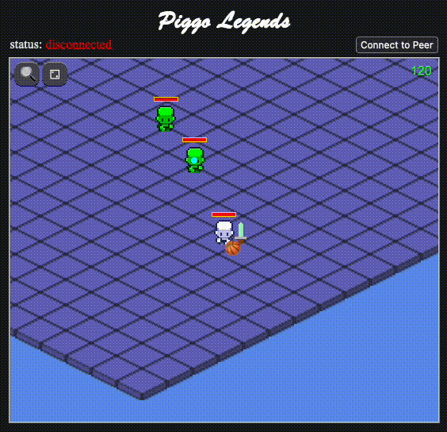

__Piggo Legends__ is a game engine for 2D multiplayer web games. Play online at [github.io](https://alexanderclarktx.github.io/piggo-legends/) 

<p align="left">
  
</p>

# Objectives

🎮 Games are easy to implement with Piggo Legends ECS

👾 Multiplayer is simple and performant

# Features

✅ custom ECS

✅ p2p webrtc & authoritative websocket server netcode

✅ WASD & physics-based movement controls

✅ isometric projection from world coordinates

✅ entity clickable callbacks & npc ai behavior

# Development

|package|description|
|--|--|
|`docs`| minified js bundle and resources served statically by GitHub Pages
|`modules`| piggo-legends libraries
|`server`| WebSocket game server
|`web`| React webpage

### setup

```bash
# install dependencies
bun install

# launch server and web
bun dev
```

### publishing to GitHub Pages
```bash
# generate minified js bundle
bun pages
```
